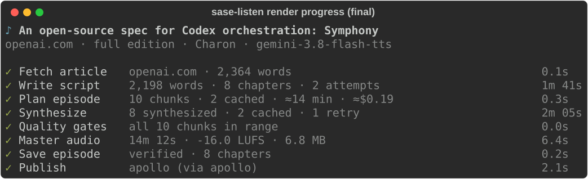

# CLI reference

Every command accepts `--help`. Commands marked **(stub)** are not implemented
yet: they exit 1 with a "not implemented yet" message. Agent-friendly commands
accept `--json` and emit exactly one JSON object on stdout.

Exit codes: `0` ok, `1` unexpected, `2` usage, `3` config/credentials,
`4` synthesis failed after retries, `5` quality gate failed, `6` structural
lint errors (`render` refuses unless `--force`), `130` interrupted by Ctrl-C.

## Live progress

`render` (and the other network-bound commands) always show what you are
waiting for: a live stage checklist with sub-steps, chunk progress, ETAs,
and retry countdowns.



Each row is one stage: Fetch article (or Read ref / Read file), Write
script, Plan episode, Synthesize, Quality gates, Master audio, Save
episode, Publish. The active row shows the current step in plain English
(`attempt 2 of 3 · fixing 2 lint findings · waiting on
gemini-3.1-pro-preview`); upcoming stages stay visible as dim pending rows.
Synthesize shows a progress bar (`done/total`), one row per in-flight
chunk with its chapter title, live retry countdowns
(`retry 1 of 4 in 14s · rate-limited`), and a queued count. Completed rows
collapse to a `✓` line with a summary and duration.

The ETA appears after the first chunk finishes and is deliberately coarse
(rounded to 5 s under a minute, whole minutes above) so it never jitters.
Treat it as a rough guide, not a promise: it assumes the remaining chunks
take as long as the finished ones.

```bash
sase-listen render SOURCE [--progress {auto,live,plain,off}]
sase-listen script https://example.com/article [--progress {auto,live,plain,off}]
```

`--progress auto` (the default) picks the live checklist on a TTY and
plain lines otherwise; `--json` always disables progress. `live` forces
the checklist (useful under `script(1)`), `plain` forces line-oriented
stderr with no ANSI escapes, and `off` silences progress entirely (the
finished checklist still prints to stdout as part of the summary).

Ctrl-C stops promptly: the first press finishes in-flight chunks so they
stay cached, then exits 130 with a hint about how to resume; a second
press quits immediately without waiting for the cache writes.

## `render` — Markdown in, MP3 out

```bash
sase-listen render SOURCE [-o OUT.mp3] [-n NARRATOR] [--voice VOICE]
  [--cover IMG | -g/--generated-cover] [--dry-run] [-e {brief,full,verbatim}]
  [--html FILE] [--refresh] [--publish | --no-publish] [--no-cache] [--force]
  [--progress {auto,live,plain,off}] [--json]
```

`SOURCE` is a narration script, a plain Markdown file (normalized
automatically), a local PDF file, or a `kind:path` artifact ref (fetched
through audited `sase artifact read`), or an http(s) article or PDF URL. URL
and PDF rendering defaults to the AI-written `brief` edition; choose `full`
for an adaptation or `verbatim` for a deterministic article-text reading.
`--html FILE` uses a saved browser page (HTML or PDF), and `--refresh`
fetches or extracts the source again and replaces the cached copy. arXiv
paper URLs (for example `/abs/…`) are fetched as the paper's PDF; see
[Web articles](web-articles.md).
`--dry-run` writes the article script if needed, prints the chunk plan, and
stops.
`--publish` / `--no-publish` override the `feed.auto_publish` config.
`--cover IMG` uses explicitly chosen artwork; `-g` / `--generated-cover`
generates the title card and ignores `cover` frontmatter and any sibling
`<stem>_infographic.png`. The two cover options are mutually exclusive.
See [Reliability](reliability.md) for gates, cache, and manifests.

## `script` — normalize Markdown to a script

```bash
sase-listen script SOURCE [-o notes_narration.md] [-e {brief,full,verbatim}]
  [--html FILE] [--refresh] [--progress {auto,live,plain,off}] [--json]
```

For Markdown files, produces an `edition: verbatim`, `producer: deterministic`
script plus an omissions report. For article URLs, defaults to an AI-written
brief script; `--edition full` writes a full adaptation, and `verbatim` selects
deterministic normalization. `SOURCE` can be a Markdown file, a PDF file, or an http(s)
article or PDF URL. For URL and PDF behavior and cached source storage,
see [Web articles](web-articles.md) and [Narration scripts](narration-scripts.md).

## `lint` — validate a script

```bash
sase-listen lint episode_narration.md [--source report.md] [--strict] [--json]
```

Exits 1 on errors, or on warnings with `--strict`. `--source` adds the
number-fidelity check: every number in the script must appear in the source.

## `guide` — print the authoring rules

```bash
sase-listen guide [--edition {brief,full}]
```

Prints the packaged rules hand-written scripts must follow (brief by
default; pass `--edition full` for the full-length edition). The rules ship
in the package so they never drift from the code that enforces them.

## `audition` — compare voices **(stub)**

```bash
sase-listen audition [--voices Charon,Kore] [-n NARRATOR] [--text FILE] [--json]
```

Intended: render the sample passage once per voice for comparison. Not
implemented yet (owner: cli phase follow-up).

## `ls` — list episodes **(stub)**

```bash
sase-listen ls [EPISODE] [--json]
```

Intended: list library episodes, or show one episode's manifest. Not
implemented yet (owner: cli phase follow-up). Meanwhile, episodes live under
`$XDG_DATA_HOME/sase-listen/library/<slug>-<hash>/` with `manifest.json`.

## `doctor` — check the setup

```bash
sase-listen doctor [--online] [--json]
```

Checks config load, ffmpeg resolution, credential presence, writable
directories, and feed configuration. `--online` is intended to add a one-word
live synthesis check; **it is a stub today** and reports
`FAIL: credentials (online check not implemented yet)`.

## `cache` — inspect the chunk cache **(stub)**

```bash
sase-listen cache [prune] [--all] [--older-than 30d] [--json]
```

Intended: show cache stats and prune entries. Not implemented yet (owner: cli
phase follow-up). The cache itself works — `render` reads and writes it; only
the inspection command is missing. `--no-cache` on `render` bypasses it.

## `config` — show or start configuration

```bash
sase-listen config [--json]
sase-listen config init     # write a starter file
sase-listen config path     # print the config path
```

Output annotates every value with its origin (`default`, `env`, `file`).
Secrets never appear. See [Configuration](configuration.md).

## `feed`, `publish`, `unpublish` — the podcast feed

```bash
sase-listen feed [init|prune|rebuild|receive] [--base-url URL] [--json]
  [--print] [--qr] [--show-url]
sase-listen publish EPISODE|--latest|--pending [--json] [--show-url]
sase-listen unpublish EPISODE [--json]
```

`EPISODE` is an episode id, an episode MP3 path, or `--latest`.
`--pending` flushes the retry outbox. `feed receive EPISODE_ID --json`
is the internal host-only transport (stdin tar); do not call it by
hand. `publish` supersedes same-title feed episodes (feed copies only;
the library is kept) and reports `superseded`/`replaced` in `--json`.
See [Podcast feed](podcast-feed.md) and
[Multi-machine publish](multi-machine.md).

## Non-TTY and `NO_COLOR` behavior

`--progress auto` (the default) is `off` with `--json`, `live` when stderr
is a terminal and `TERM` is not `dumb`, and `plain` otherwise. `NO_COLOR`
only removes color: the live checklist still renders and animates, just
without color. Plain mode writes line-oriented text to stderr with no ANSI
escapes and no carriage returns, so it is safe to pipe and log. `--json`
always emits exactly one JSON object on stdout with empty stderr,
regardless of TTY state, for agent consumption.
