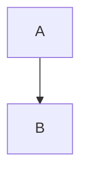

# Kitchen sink

A synthetic fixture exercising every normalizer branch. Short sentences only.

## Getting started

This paragraph links [the docs site](https://example.com/docs) and drops a
bare https://example.com/raw URL. Inline `snake_case_name` becomes words.
Press `q` to quit. The `src/sase_listen/cli.py:12` cite vanishes entirely.

### A deeper heading

H3 headings become spoken sentences. The `deadbeef1234` SHA and the
`research:202610/sample_report.md` ref vanish too. See §6 for details.

- First bullet becomes a sentence
- Second bullet follows in order

1. Ordered steps work the same
2. Without saying bullet or number

- [ ] An open task item
- [x] A done task item


The chart shows the winner clearly.


Images without useful alt text vanish silently.

> Blockquotes unwrap into plain paragraphs.

## Small tables speak

| Engine | Cost per minute |
| ------ | --------------- |
| Flash  | 0.0135          |
| Lite   | 0.009           |

## Big tables summarize

| A | B | C | D | E |
|---|---|---|---|---|
| 1 | 2 | 3 | 4 | 5 |
| 1 | 2 | 3 | 4 | 5 |
| 1 | 2 | 3 | 4 | 5 |
| 1 | 2 | 3 | 4 | 5 |
| 1 | 2 | 3 | 4 | 5 |
| 1 | 2 | 3 | 4 | 5 |
| 1 | 2 | 3 | 4 | 5 |

```python
print("fences are omitted")
```



The equation $E=mc^2$ is omitted with a note.

<!-- an HTML comment for the renderer -->

A footnote marker[^1] stays readable.

[^1]: The footnote definition is omitted.

## Sources

Anything here is omitted with a note.
